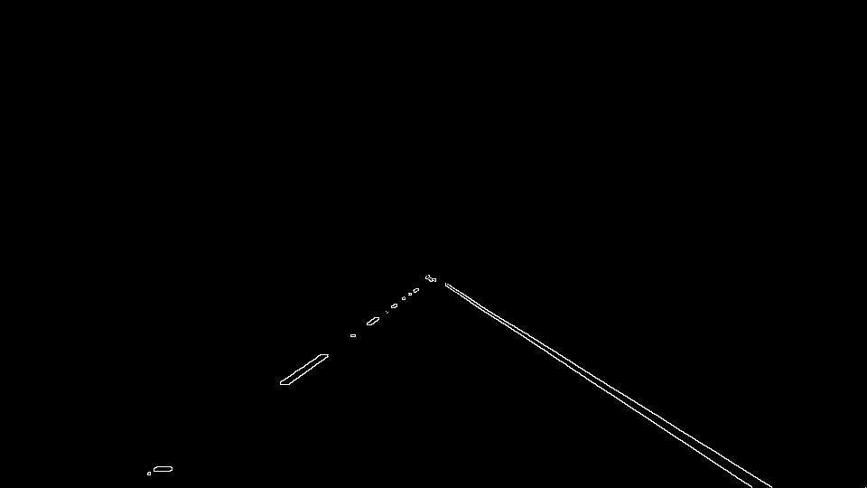

# **Finding Lane Lines on the Road** 


### Project Overview

When we drive, we use our eyes to decide where to go. The lines on the road that show us where the lanes are act as our constant reference for where to steer the vehicle. Naturally, one of the first things we would like to do in developing a self-driving car is to automatically detect lane lines using an algorithm.

In this project we will detect lane lines in images using Python and OpenCV. OpenCV means "Open-Source Computer Vision", which is a package that has many useful tools for analyzing images. We will build an algorithm that can detect lanes and annotate the location of the lanes as the car drives through. To be more specific, if we have a single scene of road image containing lanes like the following


We will build an algorithm that can annotate the same image like the following


We will then apply the alogorithm over some short video clips (series of images) and annotate the lanes as the car drives down the road.  


### Lane Detection Pipeline

The algorithm follows a series of steps that eventually has the ablity to annotate the lane lines over the image. These steps are packaged inside a pipeline with the following steps,

1. Color Filtering
2. Gaussian Blur
3. Canny Edge Detection
4. Region of Interest Selection
5. Hough Lines Overlay
6. Image Annotation

**Color Filtering**

As most people already recognized, most lanes we see in real life are either white or yellow. To properly detect lanes, we can build a mechanism that only recogonize white or yellow colors, which will block out all the objects that are irrelevant. To begin with, the image will be converted into the HSV space to reduce the dimensionality to 2. Then the color filter could be built by restricting the values pass through images' 3 color channels - only values within a certain range will be allowed, with all other values set to 0. 

To get only white colors, we will set a lower bound of values on the image 0, 150, 0 on image's RGB channels, respectively. The upper bound of this white filter will be 255, 255, 255 (effectively no upper bound since it's reaching the color channels' maximum values).

By the same way, yellow colors bounds will be [40, 0, 100], [50, 255, 255]. The result image is the following


Most irrelevant objects (cars, background sceneries) are immediately blocked out with this filter.

**Gaussian Blur**

Lanes normally are built to have high contrast with the surrounding backgrounds, which could be used as features from the edge detection algorithms. However, they are also very thin, often making the gradient very big. To solve this issue, gaussian blur could be applied, which will make the contrast transition smoother. After gaussian blur, the resulting image looks like the following.


Compared with the previous image, the resulting image after this step is slightly blurred than the previous one.

**Canny Edge Detection**

Canny's algorithm is specifically used to detect sharp changes in color around the image (gradient). Lanes presents a sharp change in color compared to its surroundings, therefore will be detected by Canny edge detection. After this operation, the resulting image becomes this


**Region of Interest**

Lanes are clearly mapped out after this process, so are some other irrelevant objects however. This is due to those irrelevant objects being white or yellow. The way to solve this issue is to persist only the region that contains our lane lines. In general, we are interested in trapzoid region which represents the view from the car's front camera.


Using cv2's fitpoly function, we are about to define a mask over the image using the appropriate vertices. The mask will only allow values in the region of interest to pass through, while setting values of all positions outside that region of interest to 0. We will define the vertices as a ratio of image size. For example, the top 2 points' x values are approximately 0.6 x image height, while the y values are hovers around 0.5 of image width (0.48 and 0.55 respectively). With the mask built, we can get a clean outline of the lanes, as shown in the following.



**Hough Lines Overlay**

Hough transform is the popular technique to represent shape in mathematical form, even the shape could be distorted a bit. Using the parameters defined in cv2's houghLines function, we can annotate the broken lanes like the following. 


We would like to have solid, connected lines that would clearly indicate the direction our car is driving to. To accomplish this, we will utilize the weighted average of all slopes and intercepts of the hough line segments to find the desired lane lines' slope and intercepts, weighted by each line segments length. Hough line function will return a line in form of two pairs of x, y coordinates of the line segments two endpoints (x1, y1, x2, y2). General steps are described below
1. For each line segment, find its slope with the formula `(y2 - y1)/(x2 - x1)`, its intercept from `y1 - slope * x1`, and its distance from `sqrt((y2 - y1)^2 + (x2 - x1)^2)`
2. Use slope's positive/negative characteristic we can separate lines into left lanes and right lanes, also set thresholds for acceptable slope ranges as restrictions on irrelevant obejects being detected by hough lines
3. Save these 3 datapoints into 2 separate lists as [(slope 1, intercept 1), (slope 2, intercept 2), ...] and [d1, d2, ...] for left and right lanes, depending on the slope
4. Take the weighted average of all slopes and intercepts for both the left and right lanes, obtaining two tuples - (left slope, left intercept), (right slope, right intercept) respectively
5. For both lanes, convert the (slope, intercept) pair into the two end points pair (x1, y1, x2, y2) using specific y values of for those end points. Specifically, we will set the y1 equal to height of the image, while y2 is approximately 0.63 x height of the image. With slopes and intercepts defined, the 2 endpoints x values could be found by the formula `x = (y - intercept) / slope`
6. Initialize left and right lane cache lists, which will be used to save the past lane lines' endpints in the past n frames. For every frame (image passed through the lane detection algorithm) and each lane, we calculate a weighted average value of (x1, y1, x2, y2) of the current line and the past lines, with the formula 
```
(x1, y1, x2, y2) = w1 * current line (x1, y1, x2, y2) + average past lines (x1, y1, x2, y2)
```
After the smoothed line is calculated, we will append the current line into cache and draw the lines over the image previously processed. The resulting image will look like the following


The generated line segements now could be used as a mask to annotate where the lanes in a scene.

**Image Annotation**

Calculate the weighted average of original image and the line segments masked image to create the desired annotated image. Final product looks like the following


We can now try to run the detection algorithm through some short video clips and check on the performances

On straight lines of both white and yellow, the algorithm performed relatively well

white straight lanes


yellow straight lanes


for more curvey road lanes and changing background, 

### Potential Shortcomings 


One potential shortcoming would be what would happen when ... 

Another shortcoming could be ...


### Suggest Possible Improvements

A possible improvement would be to ...

Another potential improvement could be to ...
