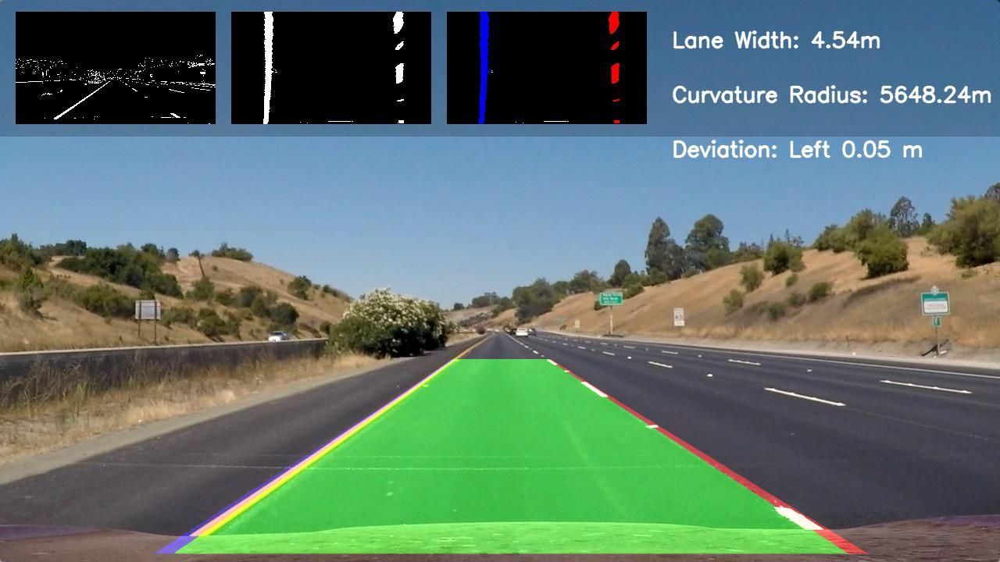
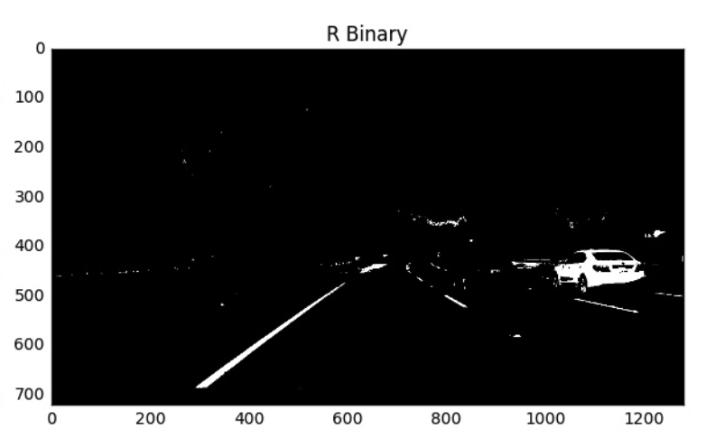
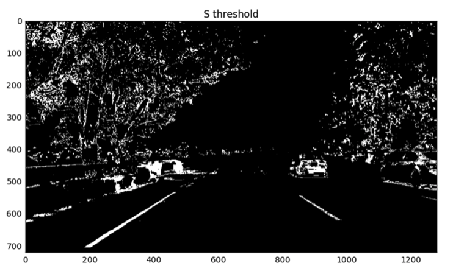
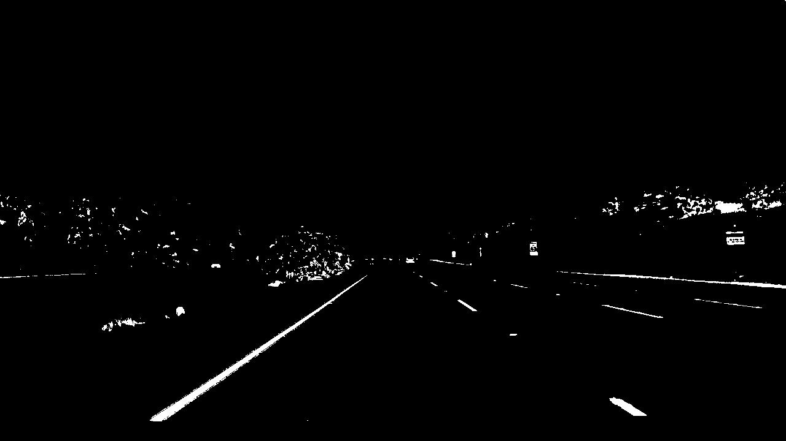
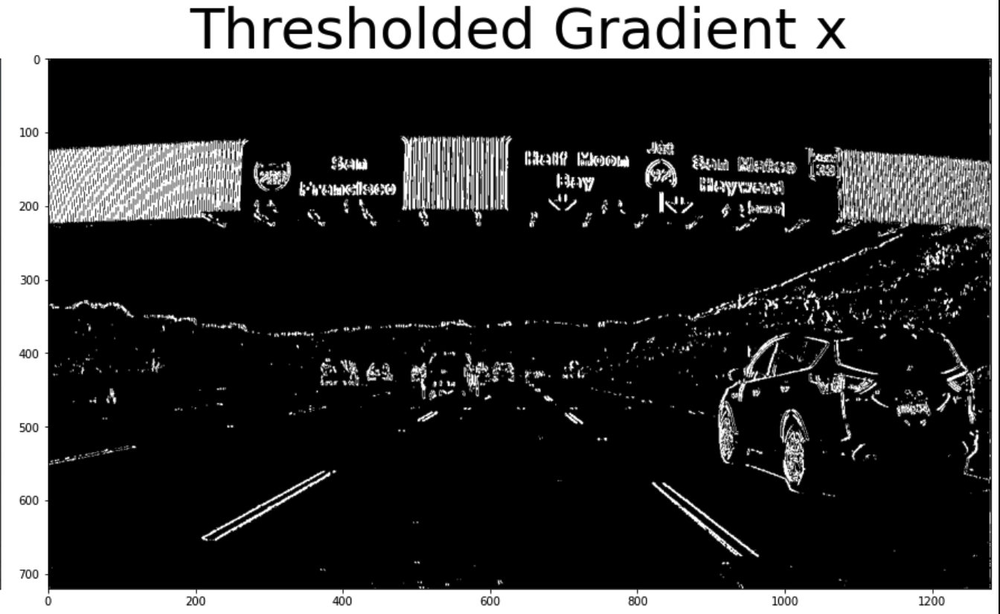
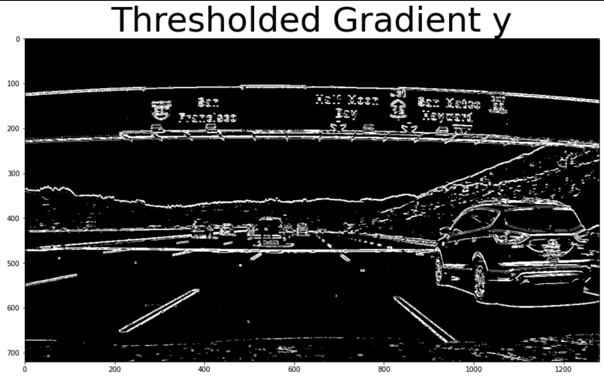
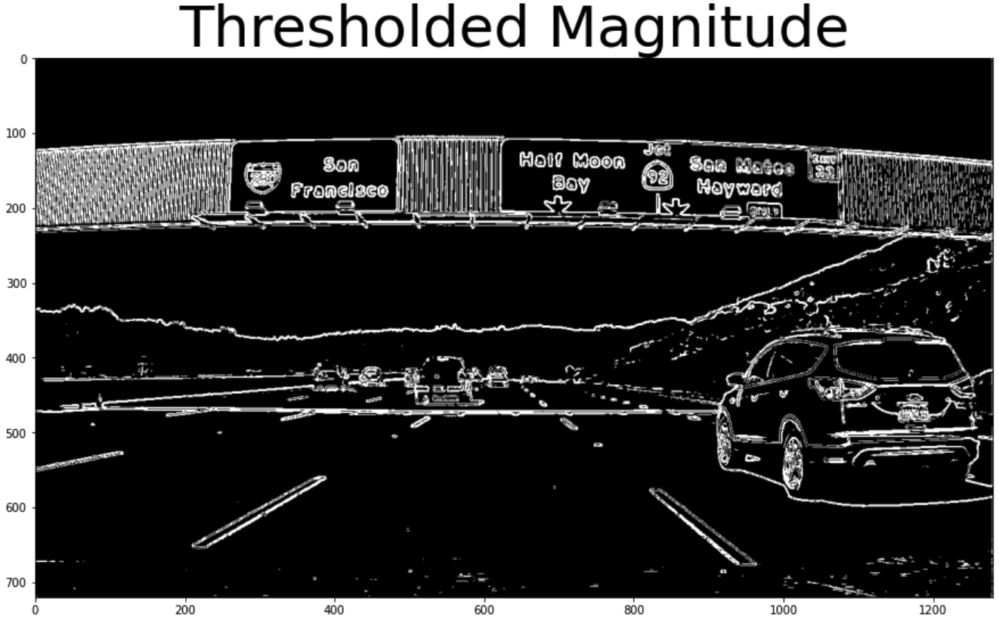

## Advanced Lane Finding

  

##
### Project Overview

Continue with what was accomplished in project 1, a more robust software pipeline to identify the lane boundaries in a video will be created using Python and OpenCV. Starting from an image scene like below

  

After processing by the pipeline the same image will be annotated with lanes highlighted and drivable areas illumniated.

  

We will then apply the same pipeline to all scenes as the car drives down the road.

The  steps of the pipeline are the following:

* Use color transforms, gradients, etc., to create a thresholded binary image
* Compute the camera calibration matrix and distortion coefficients given a set of chessboard images
* Apply a distortion correction to raw images
* Apply a perspective transform to rectify binary image ("birds-eye view")
* Detect lane pixels and fit to find the lane boundary
* Determine the curvature of the lane and vehicle position with respect to center
* Warp the detected lane boundaries back onto the original image
* Output visual display of the lane boundaries and numerical estimation of lane curvature and vehicle position

The whole pipeline was developed in object oriented programming of 6 different classes. `GradientFiltering` and `ColorFiltering` contains the binary filters that would help the pipeline segment out the potential location of lane lines. `Calibration` contains methods to calibrate the camera, undistort and warp images into bird eye views. `Line` defines a line objects which could be used to save some past information about the line, such as slopes and curvature. Finally `LaneDectionPipeline` builds the software pipeline that transform and annotate each frame of the video.

### Color Filtering

Using the HSV space filter, the noise of the image will be remnoved with the lanes singled out. By separating the image's R, G, B channel, it is evident that R channel (red) has some solid abilities to pick up the left lane

  

To strengthen that effect, the image in HSV color space's s channel (saturation) also does a great job for picking out the left lane. 

  

Using an or logic gate could allow 2 filters to cover up each other's mistakes. The combined filter produced a binary filter that is specialized in finding the left lane. The combined filtering effect is shown below

  

### Gradient Filtering

By restricting the gradient of the image of a single direction, lane objects could be emphasized in the resulting binary image. For example, restricting gradient in x and y direction will result in image binaries like the following

Gradient X          |  Gradient Y
:-------------------------:|:-------------------------:
 | 

Restricing magnitudes of the image's gradient could also be helpful in emphasizing lane lines. Applying a magnitude filter will result in a binary image like the following

    

### Camera Calibration

The images for camera calibration are stored in the folder called `camera_cal`.  

The images in `test_images` are for testing your pipeline on single frames.  If you want to extract more test images from the videos, you can simply use an image writing method like `cv2.imwrite()`, i.e., you can read the video in frame by frame as usual, and for frames you want to save for later you can write to an image file. 
 

