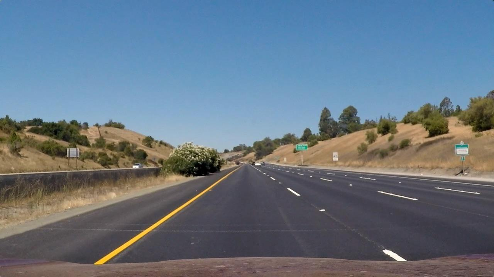
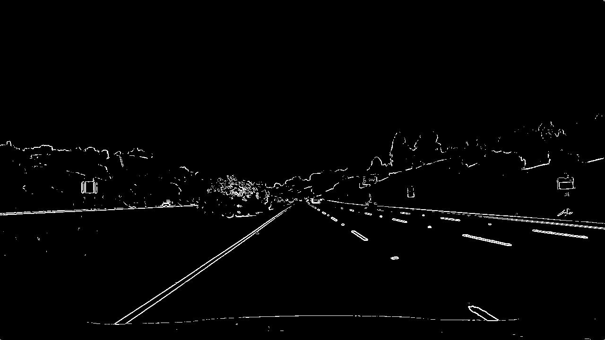
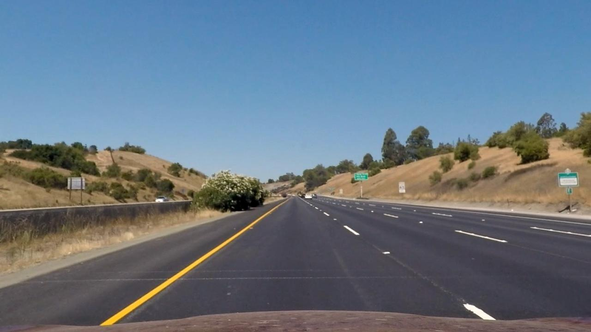
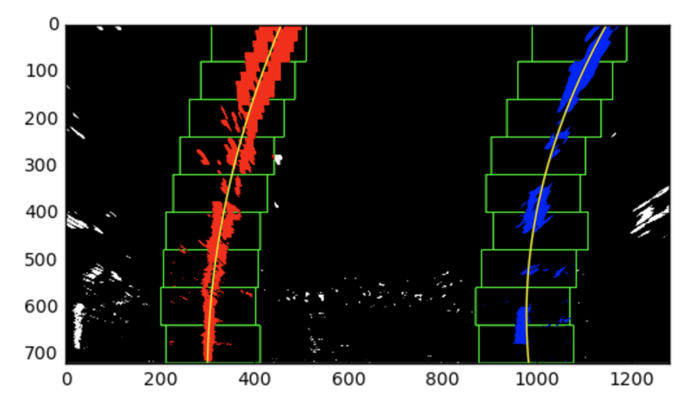

## Advanced Lane Finding

<p align="center">
  
</p>

##
### Project Overview

Continue with what was accomplished in project 1, a more robust software pipeline to identify the lane boundaries in a video will be created using Python and OpenCV. Starting from an image scene like below

<p align="center">
  
</p>


After processing by the pipeline the same image will be annotated with lanes highlighted and drivable areas illumniated.


<p align="center">
  
</p>


We will then apply the same pipeline to all scenes as the car drives down the road.


The  steps of the pipeline are the following:

* Use color transforms, gradients, etc., to create a thresholded binary image
* Compute the camera calibration matrix and distortion coefficients given a set of chessboard images
* Apply a distortion correction to raw images
* Apply a perspective transform to rectify binary image ("birds-eye view")
* Detect lane pixels and fit to find the lane boundary
* Determine the curvature of the lane and vehicle position with respect to center
* Warp the detected lane boundaries back onto the original image
* Output visual display of the lane boundaries and numerical estimation of lane curvature and vehicle position

The whole pipeline was developed in object oriented programming of 6 different classes. `GradientFiltering` and `ColorFiltering` contains the binary filters that would help the pipeline segment out the potential location of lane lines. `Calibration` contains methods to calibrate the camera, undistort and warp images into bird eye views. `Line` defines a line objects which could be used to save some past information about the line, such as slopes and curvature. Finally `LaneDectionPipeline` builds the software pipeline that transform and annotate each frame of the video.

### Color Filtering

Using the HSV space filter, the noise of the image will be remnoved with the lanes singled out. By separating the image's R, G, B channel, it is evident that R channel (red) has some solid abilities to pick up the left lane

<p align="center">
  
</p>


To strengthen that effect, the image in HSV color space's s channel (saturation) also does a great job for picking out the left lane. 

<p align="center">
  
</p>


Using an or logic gate could allow 2 filters to cover up each other's mistakes. The combined filter produced a binary filter that is specialized in finding the left lane. The combined filtering effect is shown below

<p align="center">
  
</p>

The relevant module for building this filters is in `filters.py`

### Gradient Filtering

By restricting the gradient of the image of a single direction, lane objects could be emphasized in the resulting binary image. For example, restricting gradient in x and y direction will result in image binaries like the following


Gradient X          |  Gradient Y
:-------------------------:|:-------------------------:
 | 

Gradient on y direction specializes in detecting lines in horizontal direction, since lane lines are mostly vertical in the scenes, only gradient x filter is used.


Restricing magnitudes of the image's gradient could also be helpful in emphasizing lane lines. Applying a magnitude filter will result in a binary image like the following

<p align="center">
    
</p>

magnitude filters produced a smoothed binary image that could help connecting the small segments that could help detecting lane lines. Combining the the gradient filters produced a binary image for the oringinal scene like the following

<p align="center">
    
</p>

The color filters and gradient filters will be combined with a logical or gate to pick up as much lane information as possible. The relevant module for building this gradient filter is in `filters.py`, returning the respective filtered binary image array.

### Camera Calibration and Image Undistortion

To properly undistort the images and make the measurements of the road robust, the images taken by a certain camera needs to be properly calibrated. CV2 has provided a convient way of calibrating the camera using chessboard images. The images for camera calibration are stored in the folder called `camera_cal`. By sequentially feeding images into cv2's `findChessboardCorners` method, the object and image points can be obtained and used for the cv2's `calibrateCamera` method. For example, after undistortion, the effect on one of the chessboards is the following

Chessboard 1 Original       |  Chessboard 1 Undistorted 
:-------------------------:|:-------------------------:
 | 

Once the camera is properly calibrated, the distortion matrix and coefficients could be used to calibrate the real road scene.

Road Scene Original       |  Road Scene Undistorted 
:-------------------------:|:-------------------------:
 | 

### Birdeye Transform

As objects appear larger when they are closer, directly taking measurements of the road using the images taken by the car's front camera will result in erroneuous values. The best way to normalize the effect is looking at the scene from a birdeye view. Using the birdeye view also served as a road-only filter as it crops out the extra irrelevant objects around the scene that were picked up by the previous color and gradient filters. CV2 also provided a convenient method to accomplish such goal - `getPerspectiveTransform`. The method requires source and destination points to be properly defined. Same as the previous project, the region of interest is the polygon right in front of the car, which will help define the src points for the perspective transformation. 

<p align="center">
    
</p>
 

To be specific, if the height and width of the image is h and w respectively, the source points (defined empirically) are 

```python

src = np.float32(
    [
        [w, h - 10],  # bottom right
        [0, h - 10],  # bottom left
        [546, 460],  # top left, lane top left corner from polygon
        [732, 460],  # top right, lane top right corner from polygon
    ]
)

```

The destination points will simply be the 4 corners of an image that is the same as the input image.

After the perspective transform, the image will become the following 

<p align="center">
    
</p>
 
With the image mostly containing only the lanes, it is now ready for further line detections. The undistort and birdeye transform is then combined as 1 method defined in `perspective.py`, returning the processed image array at the end.

### Lane Detection

To save some of the parameters recently obtained from fitting the previous frames, the line could be defined as a single object that contains multiple attributes. Recently fitted coefficients, base positions and line fit values in terms of x and y. Specifically, upon instantiation, the following attributes are defined.

```python
class Line:
    """"Lane line object"""

    def __init__(self, cache_size=15):
        # indicator of whether the lane was detected in the last frame
        self.detected = False
        # polynomial coefficients of the last n fits of the line in pixel unit/meters
        self.recent_fitted_coeffs_in_pix = []
        self.recent_fitted_coeffs_in_meters = []
        # distance in meters of vehicle center from the line
        self.line_base_pos = None
        # x values for detected line pixels
        self.x_pix_values = None
        # y values for detected line pixels
        self.y_pix_values = None
        # x values for fitted solid line
        self.x_pix_values_continuous_list = []
        # y values for fitted solid line
        self.y_pix_values_continuous = None
        # cache size
        self.cache_size = cache_size
```

Everytime a line segment is detected, the paramters in the Line object will be updated.

**Sliding Window**

Using the idea from integration, identifying small line segments in a small region will make the algorithm track any shape of line in the image. To start the base position will need to be identified in the image, then the small reagion will be located around the base position. By looking at the bottom half of the image, a histogram of values across x axis could be built, which will look like the following

<p align="center">
    
</p>
 
 The lane lines base position will located at the peaks of the histogram diagram. Then the same sized bounding boxes will be slided across the height of the image, with non-zero indices saved as "identified line indices".

 <p align="center">
    
</p>

***Search from Priors***

Performing the sliding window technique across all frames would be an expensive opreation, as lanes rarely changes its slopes and directions from frame to frame. Using the previously fitted polynomial coefficients, the pixel values that are within a margin will be collected as the new "identified line indices".

Sliding window method will be used on the first frame while search from priors method will be used in all frames after. The detection algorithm and the line object are defined in the file `line.py`. The method `detect` produces 2 line objects with relvant coefficients fitted 

### Annotate the Frames

Gathering from the image assets produced in previous modules, the module puts everything together an produce a blended frame that is shown at the top. Left and right lanes are colored blue and red respectively, while the drivable regions are annotated in green. At the same time, the curvature and lane departure information is also calculated (see more information with [this post](https://www.intmath.com/applications-differentiation/8-radius-curvature.php) about curvature). The method `annotate` produces a blended image array, defined in `annotate.py`.

### Putting everything together

In `main.py`, the previously described steps were executed sequentially. The number of frames are also collected for the algorithm to choose between sliding window method and search from priors. The sample signature of the execution is shown as the following.

```python
lane_detect = LaneDetectionPipeline(
    gradient_params=dict(
        sobel_kernel_size=3,
        sobel_threshold=(70, 150),
        magnitude_threshold=(70, 255),
        direction_threshold=(0.7, 1.3),
    ),
    color_params=dict(s_thresholds=(150, 255), r_thresholds=(200, 255)),
    lane_detect_params=dict(
        num_windows=9,
        window_margin=50,
        min_pixels=50,
        fit_tolerance=100,
    ),
    annotate_params=dict(
        line_width=50,
        lane_colors=[(0, 0, 255), (255, 0, 0)],
        road_region_color=(0, 255, 0),
    ),
    line_object_params=dict(cache_size=15),
    save_output=True,
)
lane_detect.process_frame(img)
```
The sample processed image is shown as the following

<p align="center">
  
</p>

The processed video could be found this [link](https://youtu.be/iDexx8XgdiY). 

<p align="center">
  
</p>

### Discussion 

* **Color filtering is crucial** - From the varying colors of the road tiles, the proper usage of color filtering will enable the algorithm to consistently see the lane lines and record the correct lane line pixels. With the current settings of the color filtering we will be able to identify lanes on most of the road conditions with consistent lighting. If the algorithm is to be more robust against tougher conditions, more variations of color filtering needs to be applied (for example LAB color spaces).

* **Usage of averaging enabled a smoothened lane marking** - tracking previously fitted coefficients with object-oriented design of the software pipeline enables the averaging across the past n fitted coefficients, producing a more stable lane and driving regions marking. However, this technique will only work under the assumptions of the absence of extreme zigzag shape of road - with rapid directional change in line slopes, the average smoothing will make the lane markings slower to adjust to the new conditions.