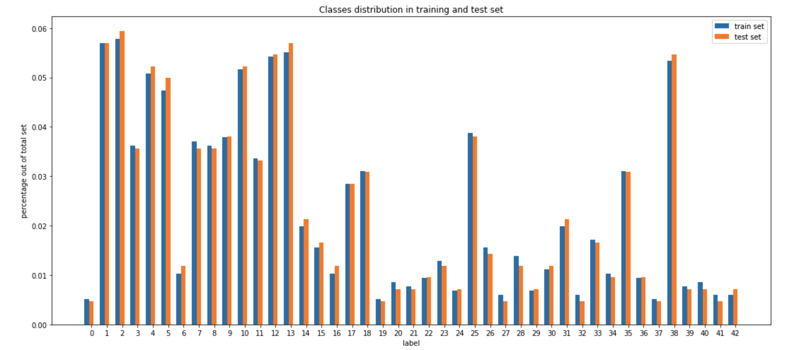
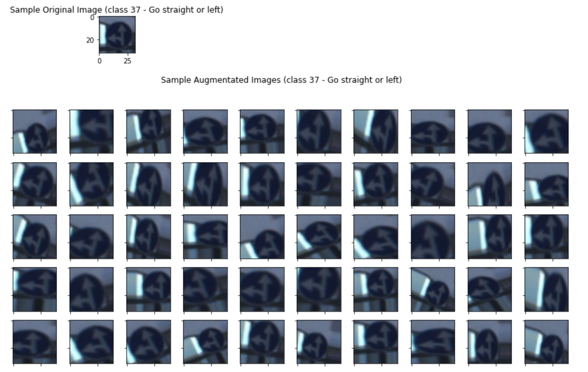
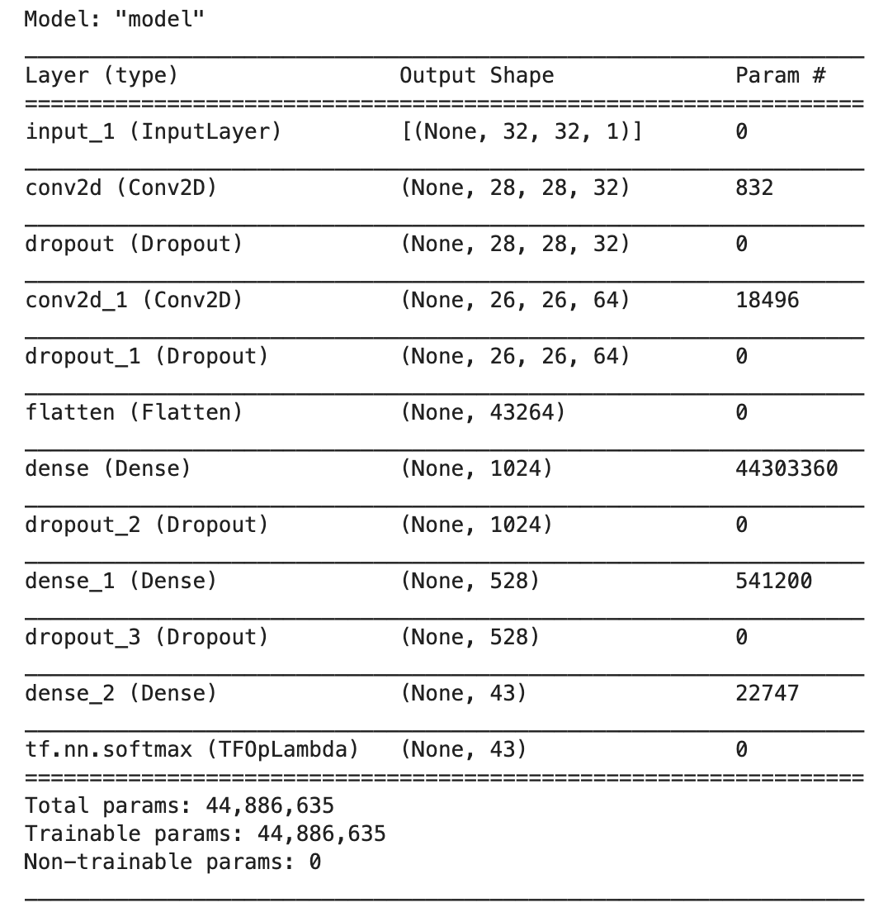
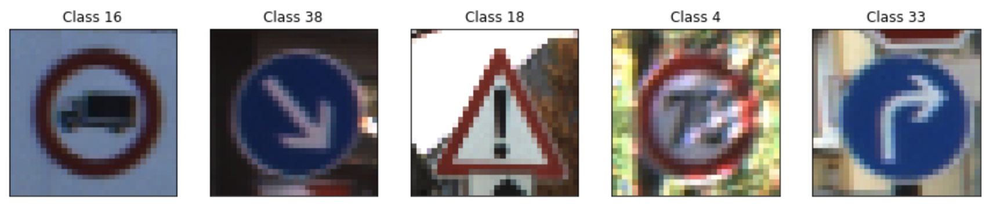
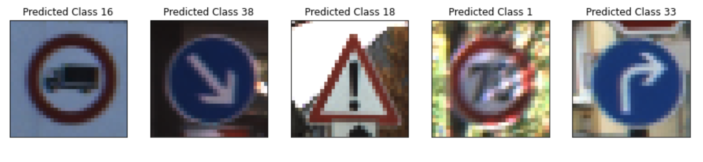
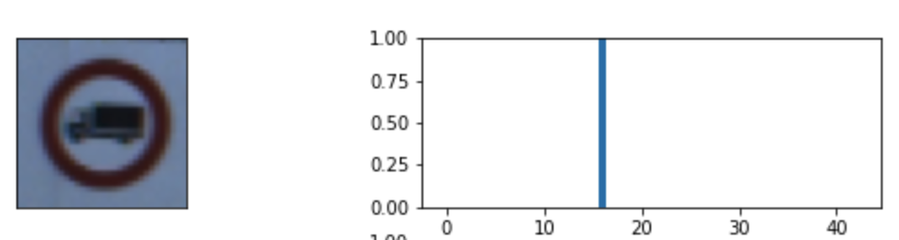
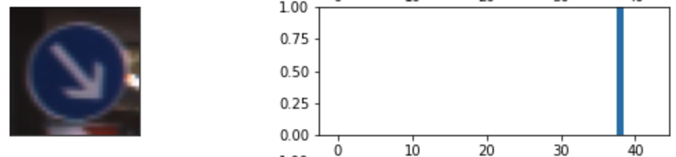
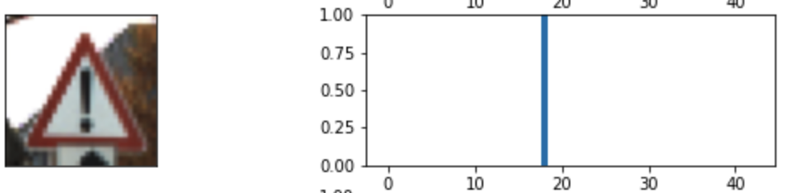
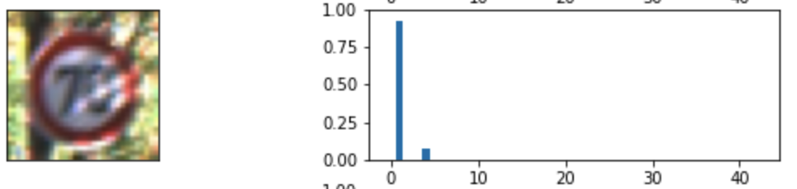
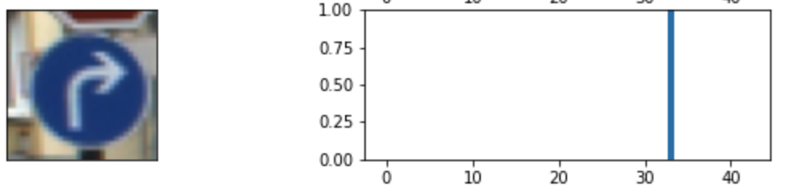

# Build a Traffic Sign Recognition Program

Overview
---
This project builds, trains and validates a model that can classify traffic sign images using the [German Traffic Sign Dataset](http://benchmark.ini.rub.de/?section=gtsrb&subsection=dataset). The trained model is subsequently tested on German traffic signs found on the web. The traffic sign recongnition pipeline is built with Tensorflow 2.4.1, containing the preprocessing steps and a subsequent deep convolutional neural network.

Required Packages
---
* tensorflow (2.4.1)
* python
* cv2
* matplotlib
* numpy 
* pandas

The Project Steps Outline
---
The goals / steps of this project are the following:
* Load the data set
* Explore, summarize and visualize the data set
* Design, train and test a model architecture
* Use the model to make predictions on new images
* Analyze the softmax probabilities of the new images
* Summarize the results with a written report

Dataset Summary
---
Pandas library is used to calculate summary statistics of the traffic
signs data set:

* The size of training set is 27839
* The size of the validation set is 6960
* The size of test set is 12630
* The shape of a traffic sign image is 32 x 32 x 3
* The number of unique classes/labels in the data set is 43

Exploratory Analysis 
---
The dataset consists of 43 different classes that represents the following signs respectively

|ClassId|SignName|
|-------|--------|
|0      |Speed limit (20km/h)|
|1      |Speed limit (30km/h)|
|2      |Speed limit (50km/h)|
|3      |Speed limit (60km/h)|
|4      |Speed limit (70km/h)|
|5      |Speed limit (80km/h)|
|6      |End of speed limit (80km/h)|
|7      |Speed limit (100km/h)|
|8      |Speed limit (120km/h)|
|9      |No passing|
|10     |No passing for vehicles over 3.5 metric tons|
|11     |Right-of-way at the next intersection|
|12     |Priority road|
|13     |Yield   |
|14     |Stop    |
|15     |No vehicles|
|16     |Vehicles over 3.5 metric tons prohibited|
|17     |No entry|
|18     |General caution|
|19     |Dangerous curve to the left|
|20     |Dangerous curve to the right|
|21     |Double curve|
|22     |Bumpy road|
|23     |Slippery road|
|24     |Road narrows on the right|
|25     |Road work|
|26     |Traffic signals|
|27     |Pedestrians|
|28     |Children crossing|
|29     |Bicycles crossing|
|30     |Beware of ice/snow|
|31     |Wild animals crossing|
|32     |End of all speed and passing limits|
|33     |Turn right ahead|
|34     |Turn left ahead|
|35     |Ahead only|
|36     |Go straight or right|
|37     |Go straight or left|
|38     |Keep right|
|39     |Keep left|
|40     |Roundabout mandatory|
|41     |End of no passing|
|42     |End of no passing by vehicles over 3.5 metric tons|

Though each class has relatively different distributions, the training and test set has similar % of distributions across these classes

 

    

Model Architecture
---
### 1. Image Data Preprocessing

Using the references from this medium post and Yann Lecun's paper, the image preprocessing was completed in the following 4 steps

1. Gaussian Blur on every single image - removes noise on edges of the inputing images

2. Convert image from RGB to YUV color space and extract only the V channel - make images invariant across every color channel except for red

3. Normalize pixel value ranges from 0 to 1 - avoids exploding / vanishing gradients while training the deep network

4. Image augumentation (random rotation and zoom in/out) - force the neural network to learn exact patterns of the traffic signs regardless the angle its being presented

An example of the images that get passed through this processing steps is the following

 

    

### 2. Model Architecture

The model is implemented as a pipeline that starts from preprocessing images, 2 convolutional layers, 3 dropout layers and 2 fully connected layers. The model architecture details are shown below.

| Layer         		|     Description / Output Size	        		| 
|:---------------------:|:---------------------------------------------:| 
| Input         		| 32 x 32 x 3 RGB image   						| 
| Preprocess Images     | 32 x 32 x 1 normalized image	                |
| Convolution 5x5     	| 1x1 stride, 32 filters, valid padding, outputs 28 x 28 x 32 |
| RELU					|												|
| Dropout				| Drop probability 0.1							|
| Convolution 3x3	    | 1x1 stride, 64 filters, valid padding, outputs 26 x 26 x 64 |
| RELU					|												|
| Dropout				| Drop probability 0.1							|
| Flatten               | 1 x 43264 vector                              |
| Fully connected		| 1 x 1024 vector                        	    |
| Dropout				| Drop probability 0.1							|
| Fully connected		| 1 x 528 vector                      			|
| Dropout				| Drop probability 0.1							|
| Fully connected		| 1 x 43 vector                         		|
| Softmax				| 1 x 43 vector						            |

Maxpooling has been left out and replaced with dropouts to increased training speed and performances, due to the fact that maxpooling will lead to loss of information during training. Valid padding also performs better than same padding as it reduces the number of paramters to train in the network.

The model summary is shown below

 

    

### 3. Model Training

To train the model, a cost function will need to be defined. Since there are 43 different classes in this model, the appropriate loss function will be the multi-class cross entropy loss between the model predicted label and the true label. The true label will be a 1 x 43 vector with the true class position being 1, everyting else being 0. The model predicted label will be 1 x 43 vector with varying values between 0 and 1.

The optimizer is defined to be Adam Optimizer, which utilizes momentum to adjust the step size to achieve better performances. The model is trained using mini-batch gradient descent whose batch size is 128. The learning rate is set to be 0.001, training for 300 steps.

### 4. Approach for Building the Model and Evaluation

The final performance of the model is 

* training set accuracy of 95.3%
* validation set accuracy of 95.0%
* test set accuracy of 86.6%

The first architecture tried that did not work well was a similar architecture but instead of dropout (0.1), 2x2 maxpooling of stride 1 was used before relu layer. Since maxpooling cause loss of information and the whole network without dropouts was really prone to overfitting. The model was able to perform extremely well on training set with ~99% accuracy, but the performance on validation set start to drop after iteration 100 after it reaches its peak at 85%. For this reason, dropout layers were addded right after relu activation layer to avoid overfitting, which was deemed to be effective. The performance on the validation set was able to reach 93% after training for 500 steps.

Maxpooling layers were eventually taken away as they added extra parameters required to train the network, which requires higher number of epochs. Also using valid padding also reduces the number of trainable parameters in the network. The number of steps required to reach current performance was reduced to 250. 

The performance of training, validation and test does not defer by 10% is an evidence of current architecture being effective. Training for more steps could further improve the performance, but the improvement won't be massive.

Test the Model on New Images
---

### New Images Chosen

Below showed a sample of randomly chosen German traffic sign images from the internet

 

    

In the chosen images, none of them was originally 32 x 32. Therefore a resize operation was performed, which might cause some loss of information. The 4 th image, in particular is smaller than 32 x 32 (original size was 24 x 24), resizing to 32 x 32 significantly lowered the resolution. From human eyes, the number on the sign looks like 73. In addition, the multi-colored background could also be a confounding factor for the model as some patterns could be falsefully recognized as features useful for classification.

### Predictions

The predictions on these 5 images are

 

    

Most of the images' classes are correctly predicted, with only the fourth image (the most difficult one) got incorrectly predicted, which brings the performance of the network to 80% on these test images. 80% accuracy is also quite close to the performance of the test set provided in the data.

### Performance Visualizations

Visualizing softmax probabilities will also give insights to the models' performances. 

For image 1, 2, 3 and 5, the model is so sure about the answer so it directly put 1 on the correct answer

Image 4 (the one that looks like 73) made the model confused a bit, eventually put 1 as the final prediction (1 is speed limit 30)

#### Image 1

Top 3 model predictions for image 1 (True label is 16)
   * Prediction = 16 with confidence 1.00 
   * Prediction = 7 with confidence 0.00
   * Prediction = 10 with confidence 0.00

 

    

#### Image 2

Top 3 model predictions for image 2 (True label is 38)
   * Prediction = 38 with confidence 1.00
   * Prediction = 34 with confidence 0.00
   * Prediction = 15 with confidence 0.00

 

    

#### Image 3 

Top 3 model predictions for image 3 (True label is 18)
   * Prediction = 18 with confidence 1.00
   * Prediction = 27 with confidence 0.00
   * Prediction = 26 with confidence 0.00

 

    

#### Image 4

Top 3 model predictions for image 4 (True label is 4)
   Prediction = 1 with confidence 0.90
   Prediction = 4 with confidence 0.10
   Prediction = 0 with confidence 0.00
   
 

    

#### Image 5

Top 3 model predictions for image 5 (True label is 33)
   * Prediction = 33 with confidence 1.00
   * Prediction = 39 with confidence 0.00
   * Prediction = 2 with confidence 0.00
   
 

    

