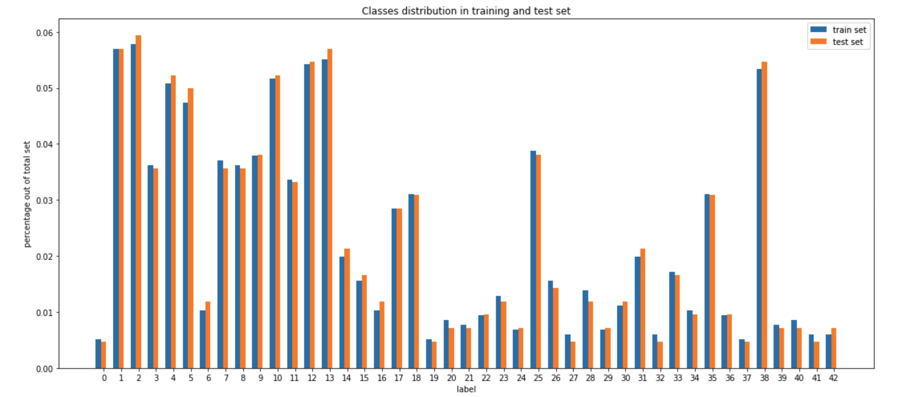

# Build a Traffic Sign Recognition Program

Overview
---
This project builds, trains and validates a model that can classify traffic sign images using the [German Traffic Sign Dataset](http://benchmark.ini.rub.de/?section=gtsrb&subsection=dataset). The trained model is subsequently tested on German traffic signs found on the web. The traffic sign recongnition pipeline is built with Tensorflow 2.4.1, containing the preprocessing steps and a subsequent deep convolutional neural network.

Required Packages
---
* tensorflow (2.4.1)
* python
* cv2
* matplotlib
* numpy 
* pandas

The Project Steps Outline
---
The goals / steps of this project are the following:
* Load the data set
* Explore, summarize and visualize the data set
* Design, train and test a model architecture
* Use the model to make predictions on new images
* Analyze the softmax probabilities of the new images
* Summarize the results with a written report

Dataset Summary
---
Pandas library is used to calculate summary statistics of the traffic
signs data set:

* The size of training set is 27839
* The size of the validation set is 6960
* The size of test set is 12630
* The shape of a traffic sign image is 32 x 32 x 3
* The number of unique classes/labels in the data set is 43

Exploratory Analysis 
---
The dataset consists of 43 different classes that represents the following signs respectively

|ClassId|SignName|
|-------|--------|
|0      |Speed limit (20km/h)|
|1      |Speed limit (30km/h)|
|2      |Speed limit (50km/h)|
|3      |Speed limit (60km/h)|
|4      |Speed limit (70km/h)|
|5      |Speed limit (80km/h)|
|6      |End of speed limit (80km/h)|
|7      |Speed limit (100km/h)|
|8      |Speed limit (120km/h)|
|9      |No passing|
|10     |No passing for vehicles over 3.5 metric tons|
|11     |Right-of-way at the next intersection|
|12     |Priority road|
|13     |Yield   |
|14     |Stop    |
|15     |No vehicles|
|16     |Vehicles over 3.5 metric tons prohibited|
|17     |No entry|
|18     |General caution|
|19     |Dangerous curve to the left|
|20     |Dangerous curve to the right|
|21     |Double curve|
|22     |Bumpy road|
|23     |Slippery road|
|24     |Road narrows on the right|
|25     |Road work|
|26     |Traffic signals|
|27     |Pedestrians|
|28     |Children crossing|
|29     |Bicycles crossing|
|30     |Beware of ice/snow|
|31     |Wild animals crossing|
|32     |End of all speed and passing limits|
|33     |Turn right ahead|
|34     |Turn left ahead|
|35     |Ahead only|
|36     |Go straight or right|
|37     |Go straight or left|
|38     |Keep right|
|39     |Keep left|
|40     |Roundabout mandatory|
|41     |End of no passing|
|42     |End of no passing by vehicles over 3.5 metric tons|

Though each class has relatively different distributions, the training and test set has similar % of distributions across these classes

 

    

Model Architecture
---
